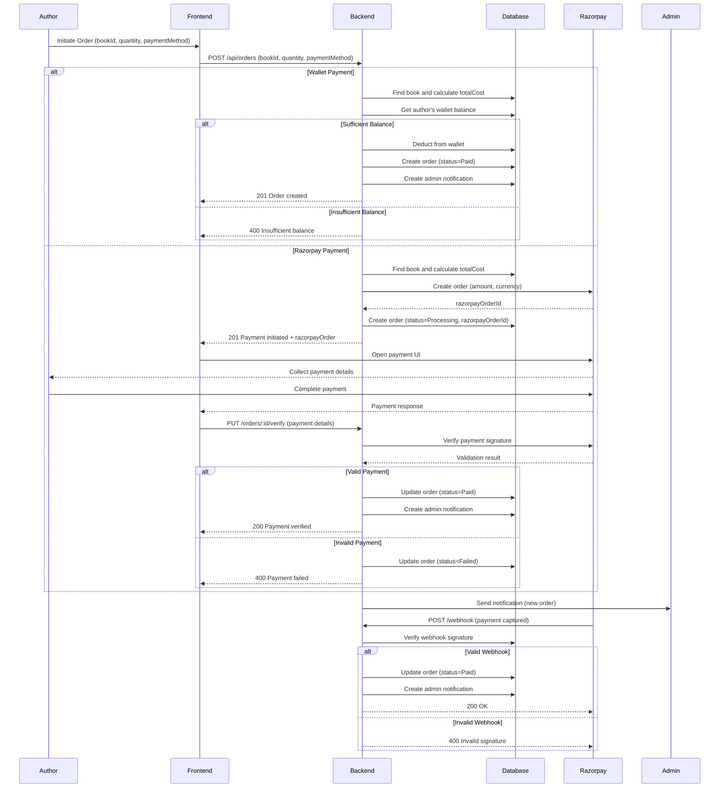

# Book Store Management API

A Node.js/Express backend for managing author books, orders, and payments.

## Features
- **Book Management**: CRUD operations for books with cover images
- **Order System**: Author copy orders with wallet & Razorpay payments
- **Royalty Tracking**: Monitor sales and calculate author royalties
- **Admin Dashboard**: Manage users, books, and orders
- **Notifications**: Real-time updates for order status and payments
- **Authentication**: JWT-based auth with role-based access control

## Tech Stack
- **Framework**: Express.js
- **Database**: MongoDB (Mongoose ODM)
- **Authentication**: JWT, Google OAuth
- **Payments**: Razorpay integration
- **File Storage**: Multer for image uploads
- **Real-time**: Socket.IO for notifications
- **Validation**: Joi schema validation

## Order Flow Sequence Diagram



## Environment Setup
1. Clone the repo
   ```bash
   git clone https://github.com/yourusername/book-store-api.git
   cd book-store-api
   ```
2. Install dependencies
   ```bash
   npm install
   ```
3. Create `.env` file (see `.env.example`)
4. Start server
   ```bash
   npm run dev
   ```

## Environment Variables
```env
PORT=5000
MONGODB_URI=mongodb://localhost:27017/author-dashboard
JWT_SECRET=your_jwt_secret
RAZORPAY_KEY_ID=your_razorpay_key_id
RAZORPAY_KEY_SECRET=your_razorpay_key_secret
RAZORPAY_WEBHOOK_SECRET=your_webhook_secret
```

## API Documentation
[View Full API Documentation](API_DOCUMENTATION.md)

## Core API Routes

### Authentication
| Method | Endpoint                | Description                     |
|--------|-------------------------|---------------------------------|
| POST   | /api/auth/register      | Register new user               |
| POST   | /api/auth/login         | Login with credentials          |
| POST   | /api/auth/google-login | Google OAuth login              |
| GET    | /api/auth/profile       | Get user profile                |
| PUT    | /api/auth/profile       | Update profile                  |

### Books
| Method | Endpoint                | Description                     |
|--------|-------------------------|---------------------------------|
| POST   | /api/books              | Create new book                 |
| GET    | /api/books              | Get author's books              |
| GET    | /api/books/:id          | Get book details                |
| PUT    | /api/books/:id          | Update book                     |
| DELETE | /api/books/:id          | Delete book                     |
| PUT    | /api/books/:id/cover    | Update book cover image         |

### Orders
| Method | Endpoint                | Description                     |
|--------|-------------------------|---------------------------------|
| POST   | /api/orders             | Create new order                |
| GET    | /api/orders/my-orders  | Get user's orders               |
| GET    | /api/orders/admin       | Get all orders (admin)          |
| PUT    | /api/orders/:id/status | Update order status (admin)     |

### Admin
| Method | Endpoint                | Description                     |
|--------|-------------------------|---------------------------------|
| GET    | /api/admin/users        | Get all users (admin)          |
| PUT    | /api/admin/users/:id    | Update user roles (admin)       |
| DELETE | /api/admin/users/:id    | Delete user (admin)             |

## Postman Collection
Import `postman_collection.json` for pre-configured API requests.

## License
MIT License